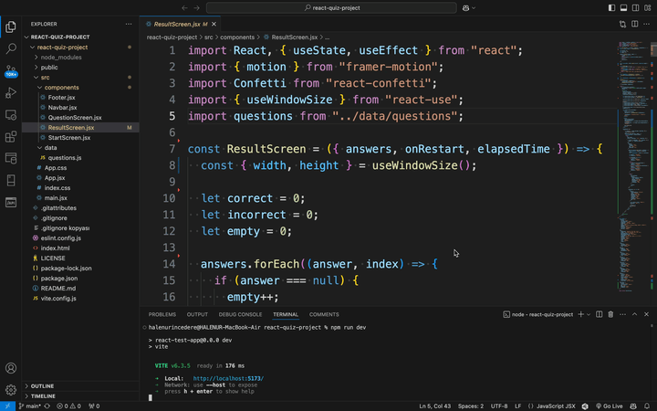
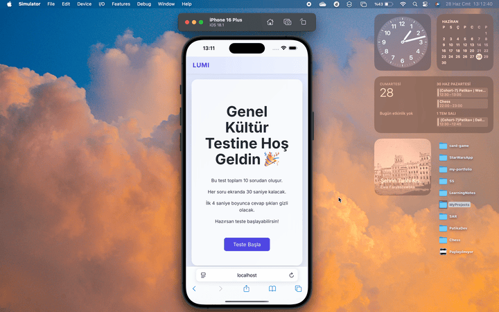

# Question App - React Question Project

Question App is a fun and interactive quiz game built with React + Vite as part of the Patika+ Frontend Projects.
It features a 10-question journey with colorful visuals, delayed answer options for suspense, and a playful result screen to show how you did — all wrapped in a clean, responsive design.

 💡 It’s not a serious test, just a light and playful Q&A challenge!

## 🔗 Live Demo

You can view the deployed version here:  
[Live Site on Netlify](https://react-question-project-patika.netlify.app)

## 🎥 Project Previews

### 💻 Desktop View  


### 📱 Mobile View  


### 🎉 Confetti View 

---

##  Project Features

- Fully responsive and accessible UI (optimized for 1400px and mobile screens).
- Built with **React** using **Vite** for lightning-fast performance.
- 10-question quiz sourced from static data (`questions.js`), including image support.
- **Start screen** with test instructions and "Start Test" button.
- **Each question:**
  - Displayed for **30 seconds max**
  - **Answer options revealed after 4 seconds**
  - Auto-skips unanswered questions (marked as blank)
- **No going back** to previous questions (one-way flow).

+ **Result screen** shows (with color-coded answers):
   - ✅ Correct answers
   - ❌ Incorrect answers
   - ⏳ Blank (unanswered) questions
   - 🧠 Visual summary of each answer
   - 🕐 Total elapsed time
   
- **Images protected** (no right-click, no drag, visual blur background).
- Mobile-first styling and consistent design system.

---

## 🛠 Technologies Used

| Tech            | Description                        |
|-----------------|------------------------------------|
| React           | Frontend library                   |
| Vite            | Development and build tool         |
| JavaScript (ES6)| Application logic and interactivity|
| CSS / Inline    | Styling (flex, media queries)      |

---

## 📁 Project Structure

```bash
src/
├── assets/
│   └── images/             # Question images
├── components/
│   ├── Navbar.jsx
│   ├── StartScreen.jsx
│   ├── QuestionScreen.jsx
│   ├── ResultScreen.jsx
│   └── Footer.jsx
├── data/
│   └── questions.js        # Question data array
├── App.jsx
└── main.jsx 
`````

---

## 🧪 How to Run the Project Locally

```bash
# Clone the project
git clone https://github.com/yourusername/react-quiz-app.git
cd react-quiz-app

# Install dependencies
npm install

# Start the dev server
npm run dev
`````


--- 

##  Requirements Checklist

• React + Vite used

• Custom design, 1400px readable layout

• 10-question flow with images

• 30s per question limit

• 4s option reveal delay

• Auto skip unanswered questions

• No back navigation

• Result screen with correct/wrong/blank count

• Responsive & accessible layout

• Deployed live with link in README

---
## License
This project is licensed under the MIT License.